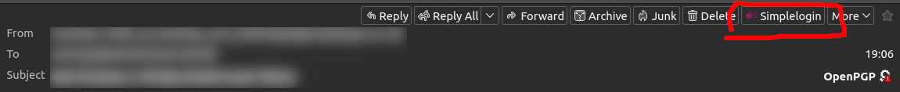
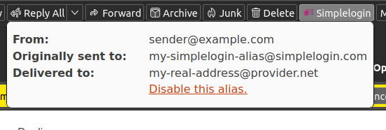

# Additional Info for E-Mails Forwarded by Simplelogin in Mozilla Thunderbird

This is a plugin for [Mozilla Thunderbird](https://www.thunderbird.net/) that displays additional information for e-mails forwarded by
[Simplelogin](https://simplelogin.io/). 

## Description

In a new pop-up above the message pane, a button appears. When clicked, a pop-up is opened which contains:

- The e-mail address from which the e-mail was sent (for this, the setting "Include original sender iin email headers" has to be activated in Simplelogin)
- The alias to which the e-mail was originally sent to
- The address to which the e-mail was then forwarded to.

## Building

To build form source, run:

```bash
cd source
zip -r ../additional-info-for-simplelogin.xpi *
```

## Screenshots


